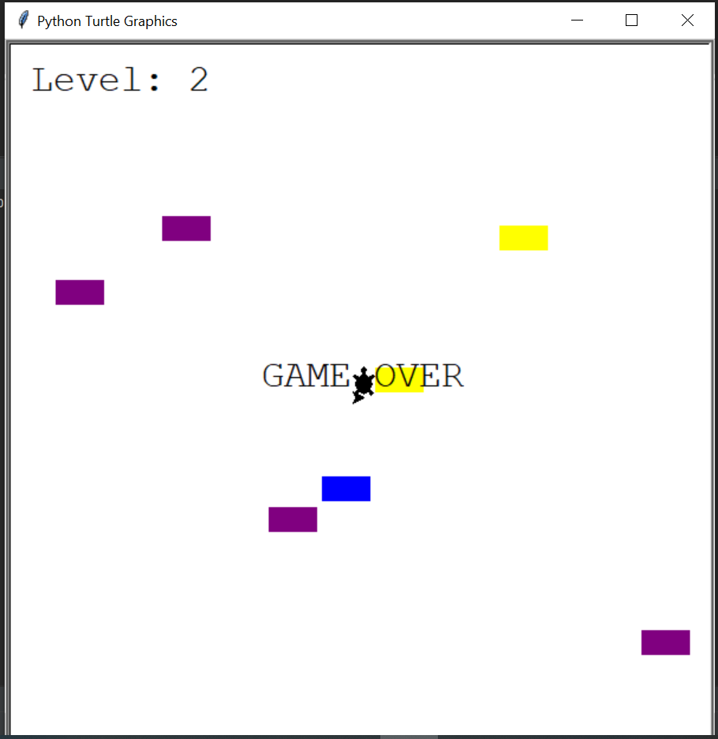

# Turtle Crossing Game

Welcome to Turtle Crossing! In this game, you control a turtle trying to cross a busy road while avoiding cars. Can you safely guide the turtle to the other side?

## How to Play

1. **Objective**: The objective of the game is to guide the turtle safely across the road without colliding with any cars.

2. **Controls**:
   - Use the up arrow key to move the turtle forward.
   - Navigate the turtle to avoid the moving cars on the road.

3. **Gameplay**:
   - The game starts with the turtle positioned at the bottom of the screen, and cars moving horizontally across the road.
   - Use the up arrow key to move the turtle forward and dodge the cars.
   - If the turtle collides with a car, the game is over.
   - Successfully guide the turtle across the road to score points and advance to higher levels.

4. **Scoring**:
   - Each time the turtle successfully crosses the road without getting hit by a car, you earn points.
   - The game can have multiple levels, with increasing difficulty as you progress.

5. **Winning**:
   - The game continues until the turtle collides with a car. Try to achieve the highest score possible!

## How to Run

To run the Turtle Crossing game, follow these steps:

1. Make sure you have Python installed on your system. You can download it from [here](https://www.python.org/downloads/).

2. Clone this repository to your local machine using the following command:

   ```bash
   git clone https://github.com/Ishay1997/turtle-crossing.git
 

